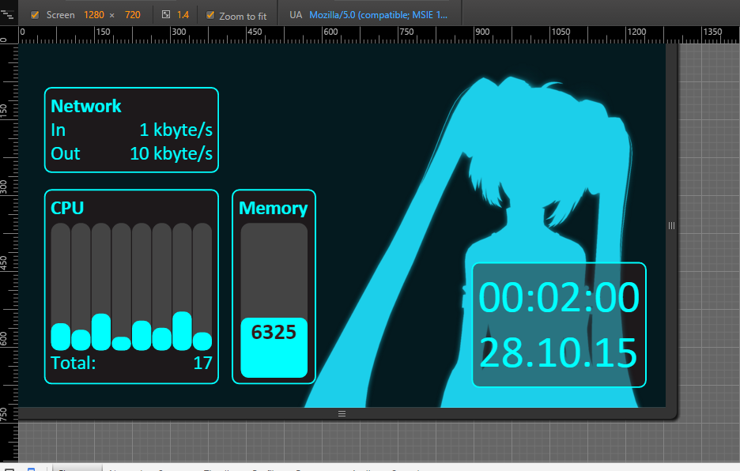

# DashBoard

ALPHA Preview



##Introduction
This is a Net.ASP webpage which allows monitoring of a local PC. It is designed to give the user information about their hardware while running fullscreen applications. A G910 (Logitech) combined with a medium or large size smartphone works great for this purpose.
Planed Moduls:
	-Hardware
	-Teamspeak 3
	-maybe Steam, nut sure about it yet

##Current available APIS
There are some APIs that can be used indipendantly from the frontend.
Apis that work for now:

- api/hardwareinfo/
- api/raminfo/
- api/networkinfo/

###Example:
http://localhost:59136/api/hardwareinfo

will deliver
```
{
    "networkInfo": {
        "kbitIn": 0,
        "kbitOut": 1.10915112
    },
    "ramInfo": {
        "available": 9944,
        "max": 16321.375
    },
    "cpuInfo": {
        "cpuLoadMap": {
            "0,6": 8.005339,
            "_Total": 7.66567,
            "0,4": 4.6487875,
            "0,5": 12.46698,
            "0,2": 24.13788,
            "0,3": 5.92857,
            "0,1": 0.3285299,
            "0,0": 11.1387882,
            "0,7": 4.85397
        },
        "numberCores": 8
    }
}
```
http://localhost:59136/api/raminfo/
will deliver
```
{
    "available": 9948,
    "max": 16321.375
}
```
and so on...

##In process
Apis in development:
- api/teamspeak


##Installation
There is no automatic installer yet, it's on the ToDo List!

- Download Visual Studio -> Load Programm -> Publish to an existing IIS
- The application Pool User needs administrator privileges!
- There must be a firewall entry for the port of the page.

##Progress
- Backend Hardware: 100%
- Basic HTML Page: 100%
- Teamspeak Modul: 20%

##Credits

Special thanks to Wulf, Sebbi, Bayne and Denyo for helping me getting shit done!!!
(and Logitech for this awesome Keyboard, that inspired me!)