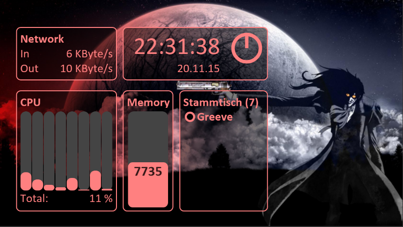

# GamerDashBoard
##Introduction
This is a Net.ASP application which allows monitoring of a local PC's hardware and Teamspeak 3 client. It provides a little server and allows displaying the information on a wi-fi-enabled smartphone or any other newer device with a browser (if javascript is enabled). The colors and the background can be customized. Its optimized for 1280x720 resolution!

Displayed Information:
 - CPU usage
 - Memory usage
 - Network usage
 - Clock and date
 - Timer function (click on the clock)
 - Teamspeak 3 (current channel, number of users, status of oneself and others, and speaking persons)

If you like it and want to support the project, feel free to give a small donation! : ) <br>
[](https://www.paypal.com/cgi-bin/webscr?cmd=_s-xclick&hosted_button_id=SVW78SGP7EZAJ)

#####Background
I started the project because my new keyboard (G910) has no display, in comparison to my old one. It's a replacement for the awesome <a href="http://www.linkdata.se/software/lcdsirreal/" target="_blank">SirReal</a> plugin. I am also trying to improve my coding skills and get in touch with new frameworks and technologies, because most of the time I work on backend components, so most of the used technologies were totally new for me.

##Downloads
<a href="https://onedrive.live.com/?authkey=%21ADVNpSSPtswXk-8&cid=96CF0FDF088011A8&group=0&id=96CF0FDF088011A8%2146723&parId=96CF0FDF088011A8%2146722&action=locate" target="_blank">Version 1.5.4.0</a>

####Requirements
- .Net Framework 4.5
- Administrator privileges

####How to Start
 - Just unzip the file, copy the files to desired location and launch the GamerDashBoard.exe
 - Click on the systray icon to see further instructions, everything is explained there


##Screenshots
Miku wallpaper with aqua colors


Hellsing wallpaper with dark colors


##Current available APIs
There are some APIs that can be used independently from the frontend.

####api/hardwareinfo/
```
{
    "networkInfo": {
        "kbitIn": 627.0155,
        "kbitOut": 11.4816256
    },
    "ramInfo": {
        "available": 8311,
        "max": 16321.375
    },
    "cpuInfo": {
        "cpuLoadMap": {
            "0,6": 24.6437016,
            "_Total": 16.7516537,
            "0,4": 10.3887644,
            "0,5": 8.352145,
            "0,2": 40.93805,
            "0,3": 16.6077633,
            "0,1": 6.317236,
            "0,0": 16.3911686,
            "0,7": 10.2734489
        },
        "numberCores": 8
    }
}
```
####api/raminfo/
```
{
    "available": 8261,
    "max": 16321.375
}
```
####api/networkinfo/
```
{
    "kbitIn": 988.23175,
    "kbitOut": 14.1787233
}
```
####api/cpuinfo
```
{
    "cpuLoadMap": {
        "0,6": 16.5853539,
        "_Total": 14.2393208,
        "0,4": 16.5853539,
        "0,5": 8.24389,
        "0,2": 29.0975513,
        "0,3": 10.2093821,
        "0,1": 8.243853,
        "0,0": 16.5853214,
        "0,7": 8.12113
    },
    "numberCores": 8
}
```
####api/teamspeakinfo
```
{
    "status": "Connected",
    "myChannel": {
        "id": "101",
        "name": "Stammtisch",
        "numberOfClients": 2,
        "clients": {
            "16": {
                "id": "16",
                "nickname": "Scratch",
                "isTalking": true,
                "client_status": "normal"
            },
            "19": {
                "id": "19",
                "nickname": "Regar\\sder\\sJägar",
                "isTalking": false,
                "client_status": "normal"
            }
        }
    },
    "myClient": {
        "id": "18",
        "nickname": "Greeve",
        "isTalking": false,
        "client_status": "normal"
    }
}
```
####api/configuration
```
{
    "networkConfig": {
        "enabled": true,
        "interfaceName": "Realtek PCIe GBE Family Controller"
    },
    "clockConfig": {
        "enabled": true,
        "alarmSeconds": 900
    },
    "cpuConfig": {
        "enabled": true
    },
    "memoryConfig": {
        "enabled": true
    },
    "tsconfig": {
        "enabled": true
    },
    "styleconig": {
        "color_r": 0,
        "color_g": 255,
        "color_b": 255,
        "b_color_r": 0,
        "b_color_g": 0,
        "b_color_b": 0,
        "b_opacity": 0.76,
        "wallpaper": "example.png"
    }
}
```
##FAQ

####How can I start the program with my pc / as a service?
Create a shortcut, add it to C:\Users\<user>\AppData\Roaming\Microsoft\Windows\Start Menu\Programs\Startup
If this doesn't work, you can run it also as a service. https://www.google.de/search?q=google.de+run+exe+as+service there are many useful tools.

####How can I enter the instructions or settings
Right-click the systray icon!

####Why can't I access the displayed IP with my smartphone?
The smartphone must be in the same network as the PC that runs this application. Make sure tcp port 13337 is open. This can be done in the settings.

#####Why does my TeamSpeak3 Module look like a mess?
Refresh the page, that should do the trick, its a bug! I hope that I will will fix it soon.

####Why do I have no network traffic?
Open the settings menu and choose another network interface; wait 1 second; rinse and repeat until one of the interfaces will deliver traffic! If not, you are most likely offline.

##Planned Features
- Logging! Much more logging!
- Autoselect of network interface
- Pizza timer alert function
- Touch Teamspeak 3 to mute yourself
- Notification service that shows notifications
- And many more things in the backlog

##Credits

Special thanks to:
- Nikola  Sivkov
- Bayne
- Wulf 
- Sebbi 
- Tobi
- Denyo 
- UmCaP Crew for testing and helping 
(and Logitech for this awesome Keyboard that inspired me! G910 )
