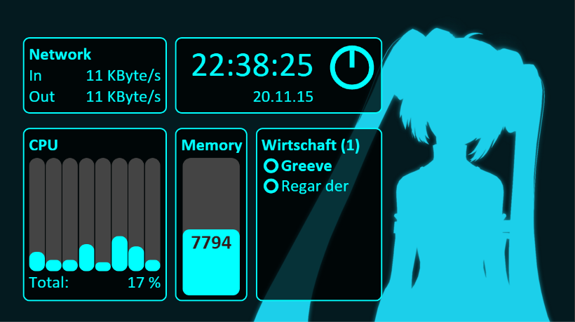

# GamerDashBoard
##Introduction
This is a Net.ASP webpage which allows monitoring of a local PCs hardware and Teamspeak 3 Client. It displays the information on a wi-fi-enabled smartphone or any other newer device with a browser, that has javascript enabled. The Colors and the background can be customized.

A G910 (Logitech) combined with a medium to large sized smartphone screen works great for this purpose!

Displayed Information:
 - CPU usage
 - Memory usage
 - Network usage
 - Clock and Date
 - Timer function
 - Teamspeak 3 (current Channel, number of users, status of oneself and others, speaking persons)
	
If you like it and want to support the project, feel free to give a small donation! : ) <br>
[](https://www.paypal.com/cgi-bin/webscr?cmd=_s-xclick&hosted_button_id=SVW78SGP7EZAJ)

##Downloads
<a href="https://onedrive.live.com/?authkey=%21ADVNpSSPtswXk-8&cid=96CF0FDF088011A8&group=0&id=96CF0FDF088011A8%2146723&parId=96CF0FDF088011A8%2146722&action=locate" target="_blank">Version 1.5.4.0</a>

####Requirements
- .Net Framework 4.5
- Administrator previleges

####How to Start
 - Just unzip the file, copy the files to desired location and launch the GamerDashBoard.exe
 - click on the systray item to see further instrcutions


##Screenshots
Miku Wallpaper with Aqua Colors


Hellsing Wallpaper with dark Colors


##Current available APIs
There are some APIs that can be used independently from the frontend.

####api/hardwareinfo/
```
{
    "networkInfo": {
        "kbitIn": 627.0155,
        "kbitOut": 11.4816256
    },
    "ramInfo": {
        "available": 8311,
        "max": 16321.375
    },
    "cpuInfo": {
        "cpuLoadMap": {
            "0,6": 24.6437016,
            "_Total": 16.7516537,
            "0,4": 10.3887644,
            "0,5": 8.352145,
            "0,2": 40.93805,
            "0,3": 16.6077633,
            "0,1": 6.317236,
            "0,0": 16.3911686,
            "0,7": 10.2734489
        },
        "numberCores": 8
    }
}
```
####api/raminfo/
```
{
    "available": 8261,
    "max": 16321.375
}
```
####api/networkinfo/
```
{
    "kbitIn": 988.23175,
    "kbitOut": 14.1787233
}
```
####api/cpuinfo
```
{
    "cpuLoadMap": {
        "0,6": 16.5853539,
        "_Total": 14.2393208,
        "0,4": 16.5853539,
        "0,5": 8.24389,
        "0,2": 29.0975513,
        "0,3": 10.2093821,
        "0,1": 8.243853,
        "0,0": 16.5853214,
        "0,7": 8.12113
    },
    "numberCores": 8
}
```
####api/teamspeakinfo
```
{
    "status": "Connected",
    "myChannel": {
        "id": "101",
        "name": "Stammtisch",
        "numberOfClients": 2,
        "clients": {
            "16": {
                "id": "16",
                "nickname": "Scratch",
                "isTalking": true,
                "client_status": "normal"
            },
            "19": {
                "id": "19",
                "nickname": "Regar\\sder\\sJägar",
                "isTalking": false,
                "client_status": "normal"
            }
        }
    },
    "myClient": {
        "id": "18",
        "nickname": "Greeve",
        "isTalking": false,
        "client_status": "normal"
    }
}
```
####api/configuration
```
{
    "networkConfig": {
        "enabled": true,
        "interfaceName": "Realtek PCIe GBE Family Controller"
    },
    "clockConfig": {
        "enabled": true,
        "alarmSeconds": 900
    },
    "cpuConfig": {
        "enabled": true
    },
    "memoryConfig": {
        "enabled": true
    },
    "tsconfig": {
        "enabled": true
    },
    "styleconig": {
        "color_r": 0,
        "color_g": 255,
        "color_b": 255,
        "b_color_r": 0,
        "b_color_g": 0,
        "b_color_b": 0,
        "b_opacity": 0.76,
        "wallpaper": "example.png"
    }
}
```
##Credits

Special thanks to:
- Nikola  Sivkov
- Bayne
- Wulf 
- Sebbi 
- Denyo 
- UmCaP Crew for testing
(and Logitech for this awesome Keyboard, that inspired me! G910 )
